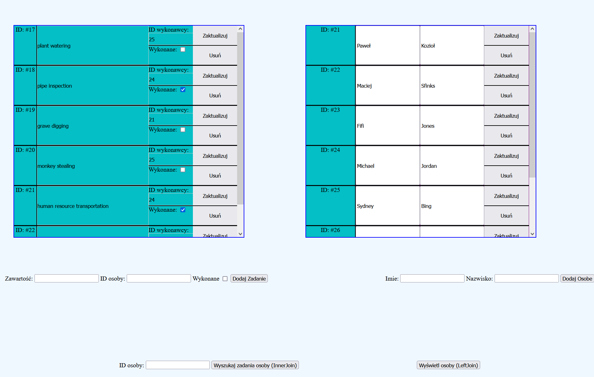

# Overview
This repository contains PHP and SQL projects developed during the 'Database Basics' class at AGH University of Krakow in the third semester.

# Contents
The repository is organized into two main directories:

- **mini-projects**: Contains smaller projects completed throughout the semester.
- **final-project**: Contains the final project for the course.

# Final Project
The final project is a PHP web application integrated with an SQL database, designed to manage tasks and the people responsible for them. This project implements full CRUD (Create, Read, Update, Delete) functionality.

### Features
- **Task Management**:
  - **Create**: Add new tasks to the database.
  - **Read**: View detailed information about tasks.
  - **Update**: Edit existing tasks.
  - **Delete**: Remove tasks from the database.
- **People Management**:
  - **Create**: Add new people to the database.
  - **Read**: View detailed information about people.
  - **Update**: Edit existing people.
  - **Delete**: Remove people from the database.
- **User Interface**:
  - A user-friendly and simple UI for seamless interaction. Although it is pretty ugly.
 
## Requirements 
- PHP 8.2.0 or higher.
- The database (included in the repository).

